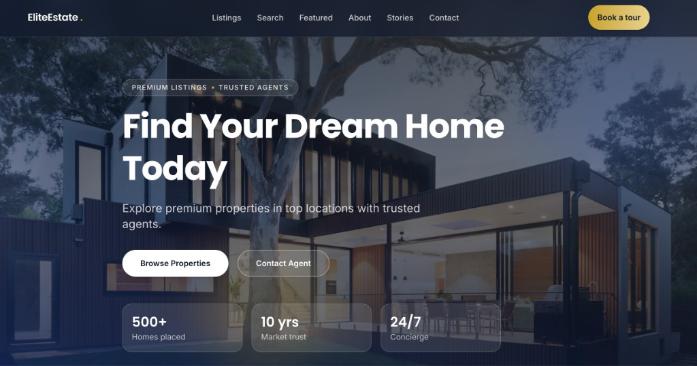
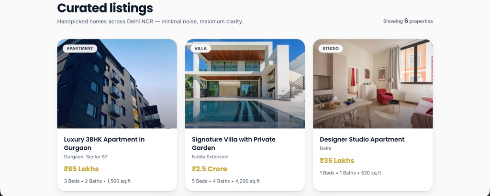

# EliteEstate — Premium Real Estate Website

A **single-page, production-ready** marketing site for high-end real estate: minimal luxury UI, glassmorphism, smooth motion, and client-side listing filters. Built to feel like a **premium SaaS product** while staying fast and easy to navigate.

**Live demo:** [https://real-estate-three-murex-13.vercel.app/](https://real-estate-three-murex-13.vercel.app/)

---

## Preview

### Hero

Full-viewport luxury property imagery, gradient overlays, glass stat tiles, and clear CTAs (*Browse Properties*, *Contact Agent*).



### Curated listings

Responsive property grid with category badges, locations, gold-highlighted prices (₹), and bed / bath / sq.ft. lines. Count updates when filters change.



---

## Features

| Area | Details |
|------|---------|
| **Hero** | Parallax background, floating glass orbs, premium copy, dual CTAs, trust metrics (500+ homes, 10 yrs, 24/7). |
| **Listings** | Six dummy NCR properties; cards with **3D tilt** and image zoom on hover (respects `prefers-reduced-motion`). |
| **Search** | Price min/max sliders, location and property-type selects; **filters the grid** above with layout-friendly transitions. |
| **Featured** | Large asymmetric spotlight card with glass styling and *View Details*. |
| **About / testimonials / contact** | Brand story, three client quotes, contact form + **WhatsApp** CTAs. |
| **Footer** | Quick links, contact info, social placeholders. |
| **A11y & UX** | Semantic sections, labels, focus-visible rings, smooth scroll, fixed nav with mobile menu. |

---

## Tech stack

- **[Vite](https://vitejs.dev/)** + **[React 19](https://react.dev/)** + **[TypeScript](https://www.typescriptlang.org/)**
- **[Tailwind CSS v4](https://tailwindcss.com/)** (`@tailwindcss/vite`) — tokens for page / ink / gold / blue, soft shadows, glass panels
- **[Framer Motion](https://www.framer.com/motion/)** — scroll-linked hero motion, reveals, card micro-interactions
- **Fonts:** [Inter](https://fonts.google.com/specimen/Inter) + [Poppins](https://fonts.google.com/specimen/Poppins) (Google Fonts)
- **Imagery:** [Unsplash](https://unsplash.com/) URLs in [`src/data/properties.ts`](src/data/properties.ts)

---

## Getting started

```bash
git clone https://github.com/abhishekgoyal-a11y/Real-Estate-Website.git
cd Real-Estate-Website
npm install
npm run dev
```

Open the URL Vite prints (usually [http://localhost:5173](http://localhost:5173)).

| Script | Purpose |
|--------|---------|
| `npm run dev` | Development server with HMR |
| `npm run build` | Typecheck + production bundle to `dist/` |
| `npm run preview` | Serve the production build locally |
| `npm run lint` | ESLint |

---

## Project structure

```
src/
├── App.tsx                 # Page composition + filter state
├── config.ts               # Brand, contact, WhatsApp E.164 placeholder
├── data/properties.ts      # Typed listings + helpers
├── index.css               # Tailwind @theme + base styles
├── lib/filterProperties.ts # Client-side filter logic
└── components/             # Navbar, Hero, grids, sections, Footer
docs/screenshots/           # README preview images (hero, listings)
```

Replace **`WHATSAPP_E164`** in [`src/config.ts`](src/config.ts) with your real WhatsApp number (digits only, country code included, no `+`).

---

## Deploy

This repo is a static SPA after `npm run build`. **Vercel:** connect the GitHub repo, framework preset **Vite**, build command `npm run build`, output directory **`dist`**.

---

## License

This project is provided as-is for portfolio and client-demo use. Add a `LICENSE` file if you need a specific terms for redistribution.
